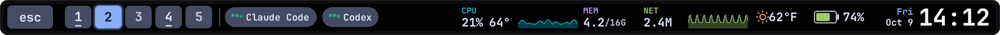
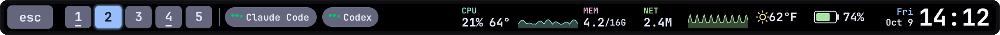
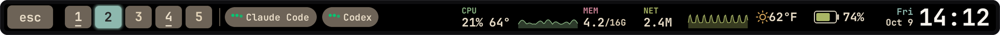
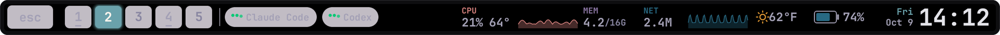
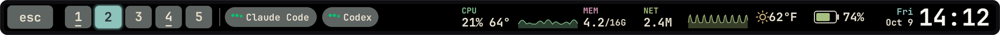
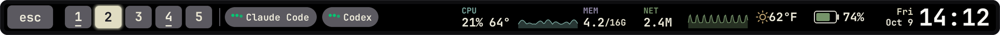
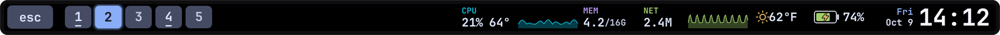
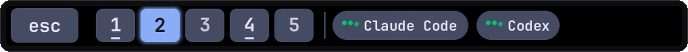
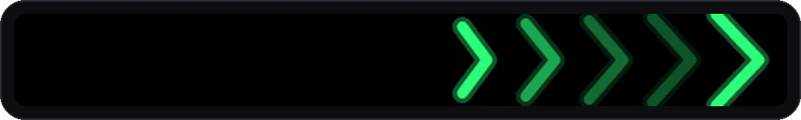

# t1-dash: alternative Touch Bar renderer

This is a second, independent renderer for the T1 Touch Bar. It does not
replace Workstream: Workstream stays the default in this repository, and you
pick one or the other by pointing `~/.config/t1bridge/renderer` at it. The two
share nothing except the T1Bridge renderer socket.

Where Workstream is an activity ribbon, this one is a compact dashboard:
Escape, Hyprland workspaces and agent activity on the left, a free middle, and
CPU (percent, temperature, sparkline), memory used/total, network sparkline,
weather, battery (with a charging bolt) and date/time on the right. Holding Fn
shows Escape plus F1 to F12. Colors follow the current Omarchy theme.



## Gallery

These frames come from the renderer's own drawing code, rendered headlessly at
2x with sample data. The rounded frame is added for display.

Tokyo Night, with two tools reporting activity:


The bar follows the current Omarchy theme. Catppuccin, Gruvbox, Rose Pine,
Everforest and Kanagawa:







No activity, charger connected:



Activity widget, animated:



Holding Fn shows Escape and F1 to F12:


During a Touch ID prompt, green chevrons sweep toward the sensor:



Ambient mode while the screensaver runs:


## Why two renderers

Workstream was the first renderer, an alpha to prove a custom Touch Bar was
possible on Linux. t1-dash is the more polished take. I built it once the Touch
Bar and Touch ID started surviving sleep (see [S3 sleep and T1 wake](sleep.md)),
because until then the bar went dark after the first suspend. Both stay in this
repository; use whichever you prefer.

## Features

- **Workspaces:** pills follow Hyprland's `socket2` events; tap to switch.
- **Activity widget:** one pill with a moving three-dot badge per file in
  `~/.local/state/touchbar/bots/` whose content starts with `working`. Any tool
  can drive it, for example from a Claude Code or Codex hook:

      touchbar-renderer/scripts/touchbar-bot claude working "Claude Code"
      touchbar-renderer/scripts/touchbar-bot claude idle

  Entries older than `bots.stale_after_secs` are ignored, so a crashed tool
  does not leave a pill behind.
- **Theme:** reads `~/.config/omarchy/current/theme/colors.toml` (or the
  state-dir equivalent) every second and recolors on change. An optional
  Omarchy `theme-set.d` hook in `hooks/` makes it immediate.
- **Weather:** the same wttr.in request and auto-location as Omarchy's bar,
  refreshed every 15 minutes and cached in `~/.cache/t1-dash/`.
- **Touch ID:** while T1Bridge reports a fingerprint prompt, green chevrons
  sweep toward the sensor at the right end of the bar.
- **OLED care:** content shifts a few pixels every few minutes; after 10
  minutes without touch, keyboard, trackpad or Hyprland activity the bar dims
  to 80% and later shows a slow ambient wave. Activity restores it.
- **Config:** `~/.config/touchbar/config.toml` sets widget order and toggles.
  `config/config.toml` is the documented example. `SIGUSR1` reloads it.

## Optional Grok Bot integration

When built with the `grok-bot` Cargo feature, the bar can also show the Grok
Bot desktop app's agents as their avatar marks, with the app's idle and working
animations, its unread count and "awaiting you" badge, and tap to focus the
app. It reads the app's local roster file read-only and makes no network calls.
`bots.enabled` in the config forces it on or off; unset, it turns on only when
`~/.config/Grok Bot/sand-client-persistence` exists. When it is off or not
built, the bots widget takes no space and the activity widget is used instead.

The avatar artwork belongs to the app and is not included. See
[touchbar-renderer/tools/README.md](../touchbar-renderer/tools/README.md) to
generate `assets/marks.json` from your own installed copy. `build.sh` enables
the feature only when that file exists.

## Build, select, and restore

Prerequisites match Workstream: a working packaged T1Bridge Touch Bar and
Rust/Cargo. Run as your desktop user:

```sh
cd touchbar-renderer
./build.sh       # release build, unit tests, previews, fake-T1Bridge smoke test
./install.sh     # copies the binary under ~/.local/libexec/t1-dash/<hash>/,
                 # saves the current renderer selection, repoints the symlink
systemctl --user restart t1-touchbar.service
```

`install.sh` changes only the renderer symlink and writes the example config
if none exists. Nothing goes into `/usr`. To go back to whatever was selected
before (Workstream or the stock renderer):

```sh
./rollback.sh
systemctl --user restart t1-touchbar.service
```

If Workstream is installed, roll this renderer back before running
Workstream's `scripts/uninstall.sh`, because that uninstaller refuses to
overwrite a selection changed after it was installed.

## Tested scope and limits

- One MacBookPro14,3, T1Bridge 0.1.12, panel 2170x60, Omarchy on Hyprland.
- 31 unit tests in generic mode, 35 with `grok-bot`, plus the fake-service
  smoke test (Escape and Fn+F5 emit the right keys). On the laptop the
  `grok-bot` build has run as the active renderer and reconnects after
  service restarts.
- The renderer cannot change the Touch Bar's own panel brightness; T1Bridge's
  brightness actions only reach the display and keyboard backlight.
- The generic activity widget was tested with unit tests and headless dumps,
  not yet on the real bar.
- In the Grok Bot integration, unread and "awaiting you" come straight from
  the app's saved roster. The "working" state is a guess from the app's local
  transcript files, because the app keeps that flag only in memory. Tapping a
  mark focuses the app; this app version has no per-agent link.
